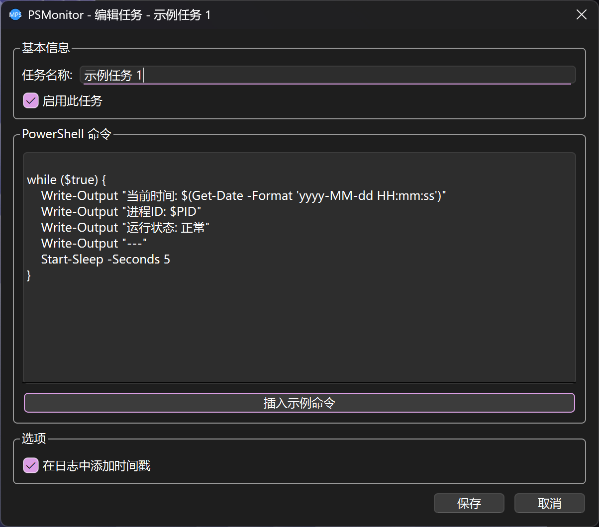

# PowerShellMonitor v1.0.0

> 一个基于 PySide6 的系统托盘应用程序，用于监控和管理多个 PowerShell 进程或其他可执行程序。

## 🎉 v1.0.0 新特性

- **多任务管理** - 同时管理多个 PowerShell 进程或可执行程序
- **可视化任务管理器** - 全新的图形化任务管理界面
- **任务配置编辑器** - 直观的任务创建和编辑界面
- **独立日志系统** - 每个任务有独立的日志文件和控制台
- **增强的系统托盘菜单** - 支持多任务快速操作
- **任务状态实时显示** - 实时显示每个任务的运行状态

## 功能特点

- 🖥️ **系统托盘集成** - 在系统托盘中运行，不占用任务栏空间
- ⚡ **多进程管理** - 同时启动、停止和监控多个 PowerShell 或其他可执行程序
- 📊 **独立日志系统** - 每个任务有独立的日志文件和查看器
- ⏰ **时间戳选项** - 可为每个任务单独配置是否在日志中添加时间戳
- 🔧 **可视化配置** - 图形化界面管理任务配置
- 🔄 **实时重载配置** - 无需重启程序即可应用配置更改
- 🚀 **开机自启动** - 支持设置开机自动启动
- 🔒 **单实例运行** - 防止程序重复打开
- 📋 **任务状态监控** - 实时显示每个任务的运行状态

## 安装和运行

### 前提条件

- Python 3.7 或更高版本
- PySide6 库
- Windows 8.1 及以上

### 安装依赖

```bash
pip install PySide6
```

### 运行程序

```bash
python main.py
```

### 打包为可执行文件

你可以直接下载 release 版本，或使用 PyInstaller 将程序打包为独立的可执行文件：

```bash
pip install pyinstaller
pyinstaller -i mps.ico --onefile --windowed --name PowerShellMonitor main.py -p "C:\Path\to\PowerShellMonitor v1"
```

打包后的可执行文件将位于 `dist` 目录中。

## 配置说明

程序会在首次运行时自动创建配置文件 `config.ini`，使用 JSON 格式存储多个任务配置：

### 配置文件结构

```ini
[DEFAULT]
TASKS = {
  "task1": {
    "name": "示例任务 1",
    "enabled": true,
    "ps_command": "while ($true) {\n    Write-Output \"当前时间: $(Get-Date -Format 'yyyy-MM-dd HH:mm:ss')\"\n    Start-Sleep -Seconds 5\n}",
    "time_stamp": true
  },
  "task2": {
    "name": "示例任务 2",
    "enabled": false,
    "ps_command": "D:\\path\\to\\your\\program.exe -argument",
    "time_stamp": false
  }
}
```

### 任务配置选项

- **name**: 任务名称（显示用）
- **enabled**: 是否启用此任务（启动时自动运行）
- **ps_command**: PowerShell 命令或可执行文件路径
- **time_stamp**: 是否在日志中添加时间戳

## 使用说明

### 系统托盘菜单

右键点击系统托盘图标可访问以下功能：


### 任务管理器

通过任务管理器可以：


### 任务编辑器

任务编辑器提供直观的界面来配置任务：



### 日志查看

每个任务都有独立的日志文件，可以通过任务菜单或任务管理器查看：


## 故障排除

### 权限问题

如果程序无法创建或写入配置文件/日志文件，请：
1. 以管理员身份运行程序，或
2. 将程序移动到有写入权限的目录

### 进程无法启动

如果指定的命令无法启动，请检查：
1. 命令语法是否正确
2. 路径是否存在
3. 是否有执行权限

### 开机自启动不工作

如果开机自启动功能不工作，请检查：
1. 程序是否位于系统启动时有权限访问的位置
2. 防病毒软件是否阻止了自启动

## 技术支持

如果您遇到问题或有建议，请：
1. 检查日志文件中的错误信息
2. 确保所有依赖项已正确安装
3. 验证配置文件格式是否正确

项目地址: https://github.com/CuberAHZ/PowerShellMonitor
作者邮箱: my@cuberliu.xyz

## 许可证

本项目使用 MIT 许可证。有关详细信息，请参阅 LICENSE 文件。

## 更新日志

### v1.0.0
- ✨ **全新多任务架构** - 支持同时管理多个 PowerShell 进程或可执行程序
- 🎨 **可视化任务管理器** - 新增图形化任务管理界面
- 📝 **任务配置编辑器** - 直观的任务创建和编辑界面
- 📁 **独立日志系统** - 每个任务有独立的日志文件和控制台
- 🖱️ **增强的系统托盘菜单** - 支持多任务快速操作
- 🔄 **实时状态显示** - 实时显示每个任务的运行状态
- 🎯 **任务启用/禁用** - 可配置任务是否在启动时自动运行

### v0.1.2
- 🛠️ 修复了日志窗口无法清除日志的问题
- 💕 筹划 v1 版本多任务功能

### v0.1.1
- 🛠️ 优化项目结构

### v0.1.0
- 初始版本发布
- 基本进程监控功能
- 系统托盘集成
- 配置文件支持
- 开机自启动功能

---

**注意**：本程序仅供学习和参考使用。在使用自定义命令时，请确保您了解命令的功能和潜在风险。